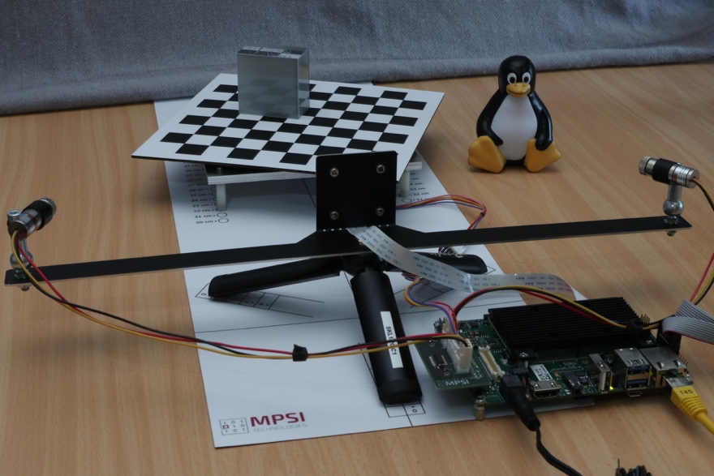
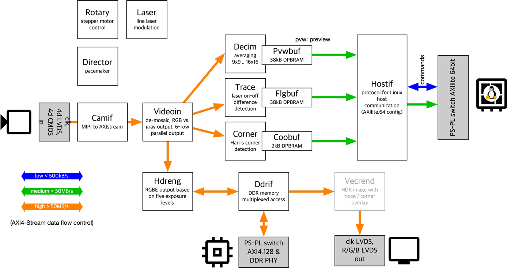

Whiznium CV Demonstrator (KB0)
==============================

*Published: April 06, 2026*

*Highlights demonstrator project and paths of exploration.*

*Categories: WhizniumDBE, Whiznium CV Demonstrator*

The fascinating world of Embedded System differs greatly from software-only environments in that any meaningful example for a developer tool requires a piece of hardware to showcase its features. To come up with a suitable demonstrator for Whiznium, additional requirements were identified which can be summarized as follows:

- adequate level of complexity: Whiznium shines at helping with sophisticated, otherwise hard-to-maintain FPGA projects. An example on the level of Blinky would not do justice to the powerful features available in Whiznium. At the same time, projects which require domain-specific knowledge would distract any first-time user from following Whiznium's learning curve. A middle ground was found with a computer vision (CV) project with easy-to-understand data flows and algorithms.

- coverage of mid-range FPGA-SoC capabilities: formerly high-performance interfaces such as MIPI CSI-2 and PCIe are now commonplace in FPGA-SoC's of medium density. Besides addressing these in the demonstrator project, emphasis was placed on thorough use of CPU-FPGA interaction mechanisms, through AXI-Lite and shared DDR memory sections.

- design involving sensor and actuators: selecting off-the-shelf camera module, line lasers and stepper motor keeps the BoM cost low while at the same time giving the opportunity to implement closed-loop control algorithms

- portability: one of the key differentiators when designing with Whiznium is its platform independence. Accordingly, the ability to base the project on low-cost development kits of each respective platform was a key design goal. A flexible adapter board solution for peripheral connectivity was implemented which is compatible with the connectors typically found on development kits: PMOD, SYZYGY or the 40-pin Raspberry Pi connector.

- hardware re-use: while the Whiznium CV demonstrator is a good starting point for learning all the diverse aspects of model-based Embedded Software design provided by the Whiznium tooling, the selected hardware components, on top of the underlying platform developer kit, allow for countless applications beyond the scope of the project. According to customer feedback these so far include Machine Learning (ML), sophisticated closed-loop control and more.

In addition to being instructional about Whiznium topics, the implementation of the RTL design also aims to exemplify best practices, such as strict adherence to industry standards (e.g. AXI-4 Stream), clear attribution of signals to processes and FSM's, clean clock domain crossings, etc. .

<b><u>Hardware</u></b>

Common hardware across variants, depicted in Figure 1, includes a robust stepper-motor (NEMA17 + additional gearing) driven turntable with printed checkerboard pattern, a cantilever which holds a camera module and dual red line lasers, as well as a tabletop tripod. To facilitate alignment and consistent results, the CV demonstrator's hard case also contains an alignment mat and a 40 cm light photo cube.

*Figure 1: Whiznium CV demonstrator hardware*

The fully implemented variants as of February 2026 include:

- AMD MPSoC: Avnet ZUBoard with AMD MPSoC 1CG; MPSI driver and adapter PCB's skpph2, skcamsyz2, syzpmod2; Vision Components IMX335 camera module (5 MP) with f = 6 mm lens; Vivado and PetaLinux (Yocto) projects.

- Efinix Titanium: Efinix Ti180J484 developer kit; MPSI driver and adapter PCB's skpph2, qtepmod2; Vision Components IMX335 camera module (5 MP) with f = 6 mm lens; Efinity and Buildroot projects.

- Microchip PolarFire SoC: Microchip PolarFire SoC Discovery kit with MPFS095T; MPSI driver PCB skraspi; ArduCam v2 IMX219 (8 MP); Libero and Yocto projects.

These variants are planned for Q2/Q3 2026:

- AMD Artix-7: Digilent Nexys Video

- Lattice Avant-E: Lattice Avant-E FPGA evaluation board

- Altera Agilex 3: Agilex 3 FPGA and SoC C-Series Development kit

There also is a lineup of vintage variants, which had been used for earlier iterations and which may be re-activated in the future:

- AMD Zynq-7000: Digilent Arty

- Lattice Crosslink-NX: Lattice Crosslink-NX Development kit

<b><u>Project features</u></b>

WhizniumDBE model files and source code for all variants' FPGA designs is provided at \[1\]. WhizniumSBE model files and sources for the Linux-based daemon can be found at \[2\].

The CV demonstrator RTL design is built in modular fashion, as shown in Figure 2. While the core processing chain between MIPI camera module and host CPU is always present, available interfaces of the platforms vary such that some variants implement a limited set of the features mentioned next.

*Figure 2: RTL design with all features*

In its most comprehensive form, these features are provided in instructional form:

- MIPI CSI-2 RX vendor IP integration with AXI-4 Stream output

- conversion between pixel formats / bit-packing

- pipelined Harris corner detection algorithm

- inter-frame delta for laser trace detection

- multi-exposure-time HDR imaging via DDR memory

- CPU-FPGA interface via AXI-4 Lite or PCI Express

Put together, all aforementioned features are used to implement a tabletop 3D laser scanner, with the point cloud of an object placed on the turntable displayed in the web UI.

<b><u>Onboarding</u></b>

The primary resource for getting started with Whiznium is the repository at <https://github.com/mpsitech/The-Whiznium-Documentation>. After following through with the first section, "Setting Up A Whiznium Development Environment On Your Workstation", among other things, the CV demonstrator model files and source code are available for inspection locally. At the time of writing, the package wznm_v1.1.16_wdbe_v1.1.51.tgz is current. It is recommended to follow the section "Setting Up WhizniumSBE and WhizniumDBE On Your Workstation" to set up a functioning Whiznium environment.

All source code repositories can also be cloned individually from these locations:

\[1\] CV demonstrator RTL code and C++ access library <https://github.com/mpsitech/wskd-Whiznium-StarterKit-Device/tree/v1.2.15i>

\[2\] CV demonstrator Linux daemon <https://github.com/mpsitech/wzsk-Whiznium-StarterKit/tree/v1.2.16i>

WhizniumDBE <https://github.com/mpsitech/wdbe-WhizniumDBE/tree/v1.1.51i>

WhizniumSBE <https://github.com/mpsitech/wznm-WhizniumSBE/tree/v1.1.19i>

The primary source for in-depth exploration of all aspects of the Whiznium CV demonstrator is the Whiznium Knowledge Base of which this article is the foundational document: <https://mpsitech.github.io/Whiznium-Knowledge-Base>

For everyday work with WhizniumSBE and WhizniumDBE, their respective reference pages are an indispensable resource:

<https://mpsitech.github.io/The-WhizniumSBE-Reference>

<https://mpsitech.github.io/The-WhizniumDBE-Reference>

Finally, MPSI Technologies provides consulting services around the efficient use of Whiznium in developer teams of any size.
