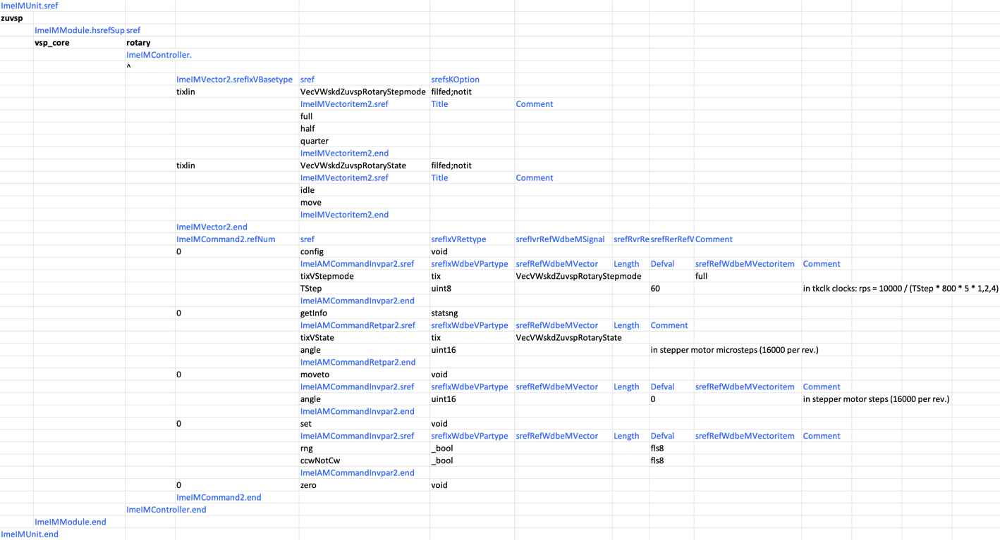
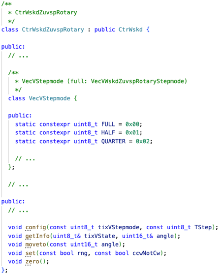
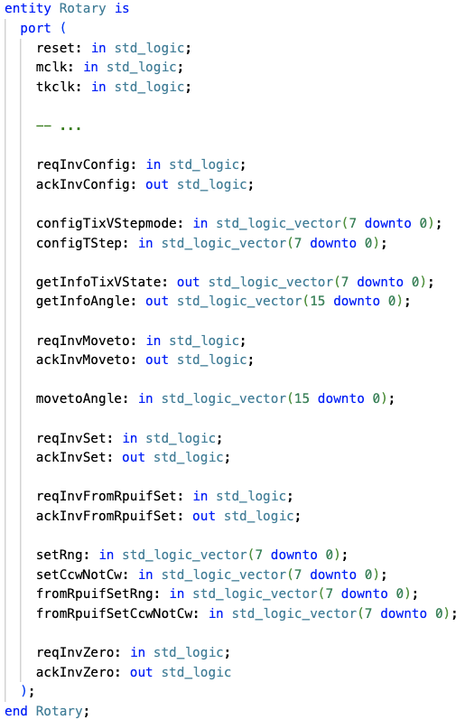
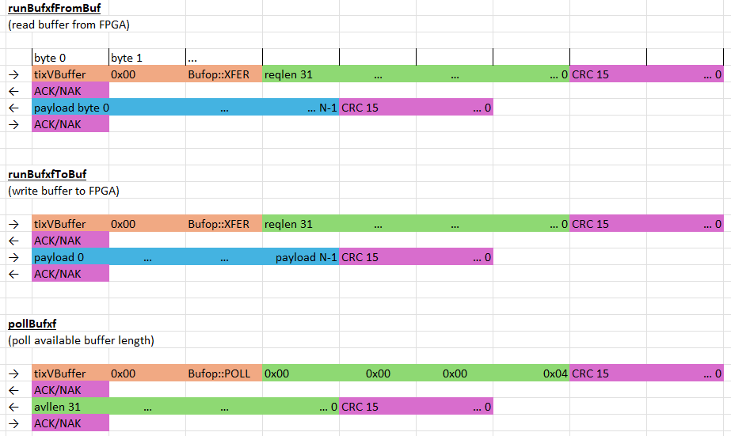
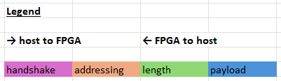
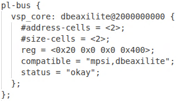
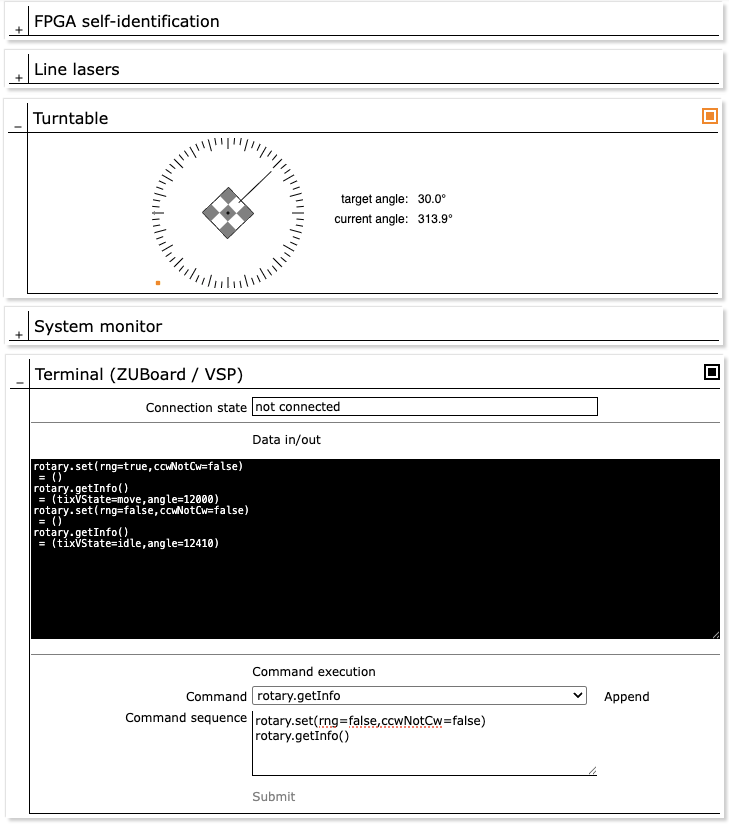

Stepper Motor Control (KB1)
===========================

*Published: February 27, 2026*

*Highlights the basic use of FPGA design sub-modules as virtual controllers.*

*Categories: WhizniumDBE, Whiznium CV Demonstrator*

Model and source code file pointers: in \[1\] \_mdl/IexWdbe{Csx, Dpl}\_wskd.xlsx, ezdevwskd/UntWskdZuvsp/CtrWskdZuvspRotary.h, fpgawskd/zuvsp/{Hostif, Rotary}.vhd, wskdterm/Wskdterm_exe.cpp; in \[2\] \_mdl/IexWznm{Gbl, Job}\_wzsk.xlsx, wzskcmbd/gbl/JobWzskSrcZuvsp.cpp, wzskcmbd/CrdWzskLlv/PnlWzskLlvTermZuvsp.cpp

Generating stepper motor pulses of correct period and duty cycle for a turntable positioning task is well-suited for programmable logic, whereas information on the required target angle typically is present in the processing system, either due to algorithmic requirements or from manual UI intervention. Hence, this is a typical example of fabric-based real-time execution with high-level CPU-based control.

The WhizniumDBE implementation starts with declaring the *rotary* RTL module a virtual *controller* and then associating commands with it. On the lowest level, this single definition results in matching CPU- and FPGA-side code artefacts to trigger and receive corresponding command invocations, as can be seen in Figures 1a-c.

*Figure 1a: IexWdbeCsx model file for rotary controller*

*Figure 1b: Resulting method in CPU host library*

*Figure 1c: Resulting method in RTL project*

On each command invocation, encoding into byte code, AXI4-Lite communication and decoding on the PL-side are handled in auto-generated code. The byte code format is detailed in Figures 2a-c.

*Figure 2a: Interface agnostic, CRC-guarded bytecode for CPU-FPGA command invocation*

*Figure 2b: CPU-FPGA interaction for buffer transfer*

*Figure 2c: Legend*

<b><u>Extra: dbeaxilite Linux kernel module</u></b>

The communication protocol outlined above is interface-agnostic which makes it viable for standalone FPGA's besides FPGA-SoC's. The host interface RTL module template hostif_Easy_v1_0 currently is implemented for UART, SPI and AXI4-Lite. Linux host-side for the former two, mainline kernel modules exist which make the FPGA subsystem available for standard read()/write() at familiar paths such as /dev/ttyUSB0 or /dev/spidev0.0, respectively.

For the AXI4-Lite variant, a dedicated out-of-tree character device driver, *dbeaxilite*, is provided with WhizniumDBE. It is compatible with 32-bit and 64-bit processors (the full data width of which it uses) and in standard mode only takes up four consecutive addresses in the global address space for establishing basic framing of the communication protocol transactions. For maximum throughput, two ioctl()'s for single vs. batch execution of commands, [*DBEAXILITE_IOC_RUNCMD* and *DBEAXILITE_IOC_RUNCMDS*, as well as one ioctl() for buffer transfers, *DBEAXILITE_IOC_RUNBUFXF*]{.mark} are implemented. They help slash the number of system calls from multiple read()/write()'s per transaction to one. This is exemplified in \[1\] ezdevwskd/UntWskdZuvsp/UntWskdZuvsp.cpp. A typical device tree snippet is shown in Figure 3.

*Figure 3: Device tree snippet for dbeaxilite*

The implementation of dbeaxilite largely avoids dynamic memory allocation except for large buffer transfers (not used in the scope of stepper motor control).

A second, experimental, RTL module template *aximmcohostif_Easy_v1_0* is provided for more classical memory-mapped interaction between host and FPGA subsystem, it requires the *mmapNotBus* flag to be specified in the device tree node.

<b><u>Extra: interactive terminal as standalone command-line executable</u></b>

The default WhizniumDBE deliverables, as specified in IexWdbeDpl_wskd, only comprise *ezdevwskd* and *fpgawskd* for CPU host library and RTL code, respectively. By adding *wskdterm* to the set, WhizniumDBE will additionally auto-generate a Linux command-line executable building on the CPU host library, which allows for the interactive execution of commands and buffer transfers on the FPGA subsystem.

Figure 4: Interactive terminal trace for command invocation and buffer transfer to file

<b><u>Extra: interactive terminal as integrated web UI feature</u></b>

To take things a step further, interactive FPGA subsystem command execution in the Linux daemon's web UI is provided if the WhizniumSBE *capability* (templated functionality for Linux daemons) *PnlWzskLlvTermZuvsp* of type *dbeterm* is specified in IexWznmGbl_wzsk. It is subsequently linked up to the web UI's host card and the FPGA subsystem source *job* in IexWznmJob_wzsk.

*Figure 5: Interactive terminal as web UI panel*

As interactive command execution is a debug-only feature, the corresponding panel is typically placed on a card that is visible to administrators only, with user access rights configured accordingly.

\[1\] CV demonstrator RTL code and C++ access library <https://github.com/mpsitech/wskd-Whiznium-StarterKit-Device/tree/v1.2.14i>

\[2\] CV demonstrator Linux daemon <https://github.com/mpsitech/wzsk-Whiznium-StarterKit/tree/v1.2.12i>
