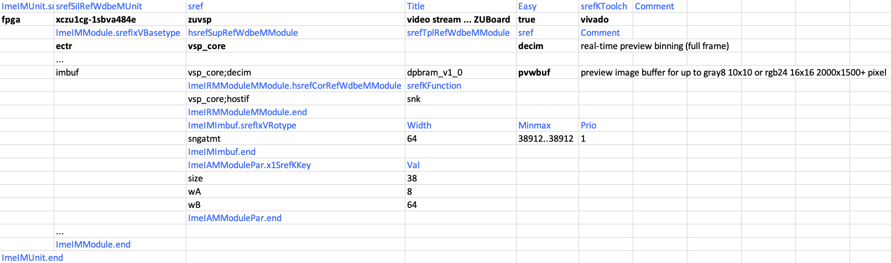

Image Decimation for Preview (KB2)
==================================

*Published: April 06, 2026*

*Highlights vertical integration from RTL level across Linux to web UI.*

*Categories: WhizniumSBE, WhizniumDBE, Whiznium CV Demonstrator, System-level Connectivity*

Model and source code file pointers: in \[1\] \_mdl/IexWdbe{Mdl,Csx}\_wskd.xlsx, fpgawskd/zuvsp/Decim.vhd; in \[2\] \_mdl/IexWznmUix_wzsk.xlsx, wzskcmbd/ gbl/JobWzsk{SrcZuvsp, AcqPreview}.{h, cpp}, wzskcmbd/CrdWzskHwc/PnlWzskHwcConfig.{h, cpp}, webappwzsk/CrdWzskHwc/PnlWzskHwcConfig{.js, \_CusImg.xml}

The camera sensor delivers frames of at least 2592x1944 raw, or 1296x972 de-mosaiced RGB resolution, at up to 60 fps with an associated data rate of \> 200 MB/s. This is excessive for displaying preview images in the web UI. To slash the data rate, on the RTL side, a decimation module, called *decim*, is implemented which, based on a single configurable *edge* parameter, averages over edge x edge raw pixels to generate preview images. This is achieved using a sophisticated load/store unit, a block RAM row buffer and a fractional multiplier that approximates the integer division required for averaging.

To achieve basic control of the *decim* RTL module from the CPU side, in the *IexWdbeCsx* model file, it is declared a *controller*. Controllers can be equipped with commands, mainly *config(rgbNotGray\[bool\], edge\[uint8\], edge2\[uint16\], NDecim\[uint16\])* for configuration, *set(rng\[bool\])* to start/stop operation and *(tixVState\[uint8\], tkst\[uint32\]) = getInfo()* for status polling in the case of *decim*. WhizniumDBE uses this information to generate a project-specific C++ library exposing these commands to user space and bytecode encoding CPU-side, along with RTL decoding and handshake logic FPGA-side.

In WhizniumDBE-backed projects, besides commands, *buffer transfers* can be attributed to controllers: they are not copy-free in the same way as DMA is but retain the interface-agnostic characteristic (for example SPI or UART instead of AXIlite) of command passing. This feature, declared as shown in Figure 1, is used to read out the 38 kB *pvwbuf* buffer which is implemented in block RAM as a sub-module of *decim*.

*Figure 1: Relevant IexWdbeMdl model file portion to infer buffer transfer*

On the CPU side, the WhizniumSBE-backed project is organized into a collection of C++ classes or *jobs*, with each job having a clearly defined responsibility for either a hardware feature or in UI / M2M session control. At runtime, job objects are assembled into an interconnected hierarchy called the *job tree*. This approach ensures non-interfering hardware access, information sharing and hardware abstraction -- when needed -- in a well-defined manner.

For the case of preview image acquisition, a separate thread *runPvw()* inside the job *JobWzskAcqPreview* handles configuration, status polling and data transfers from the FPGA side. The buffer transfer target is a three-item result buffer *resultPvw* initialized once, thus avoiding dynamic memory allocation at run-time. Once a frame acquisition completes, notification of the daemon's *job processors* (aka. worker threads) is handled via the external call *CallWzskResultNew*, which is then passed upwards the job tree to web UI jobs, specifically to *PnlWzskHwcConfig*. As each *result item* is equipped with a mutex lock, the acquisition thread can keep acquiring new preview frames from the FPGA subsystem while older frames are being processed upstream in the job tree without provoking memory access conflicts.

To enable display in the web UI, WhizniumSBE auto-generates the infrastructure for message-passing between multi-threaded daemon and web UI using HTTP(S): to this end, *dispatches*, which are C++ objects server-side, are used. They are serialized to XML or JSON (using Base64 encoding for binary data) in auto-generated code. Dispatches handling standard UI controls such as text boxes, buttons and sliders are derived automatically. For the special purpose of image display, a custom control *PnlWzskHwcConfig.CusImg* is declared along with a custom dispatch *DpchWzskHwcConfigLive* in *IexWznmUix* and *IexWznmJtr*, respectively. On reception of the *CallWzskResultNew*, one such dispatch is populated via straight copy from the FPGA-delivered data and subsequently scheduled for transfer to the web UI.

*Figure 2: Web UI display of live RGB preview image*

Finally, in the web UI, which performs continuous "long-polling" to the server, the dispatch arrives. Its RGB content is extracted into a *Uint8Array* after which the custom JavaScript method *refreshLive()* handles its display in a HTML5 canvas.

\[1\] CV demonstrator RTL code and C++ access library <https://github.com/mpsitech/wskd-Whiznium-StarterKit-Device/tree/v1.2.15i>

\[2\] CV demonstrator Linux daemon <https://github.com/mpsitech/wzsk-Whiznium-StarterKit/tree/v1.2.16i>
