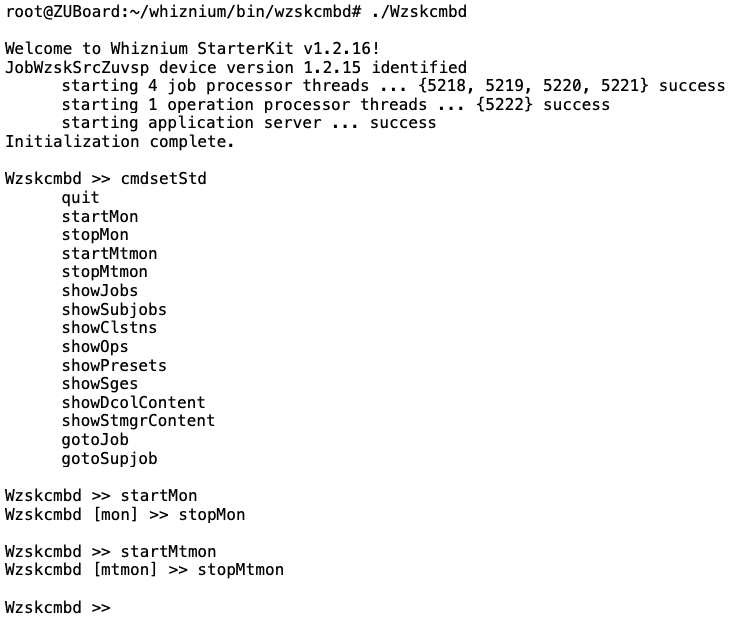
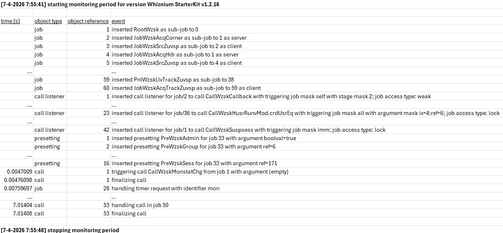
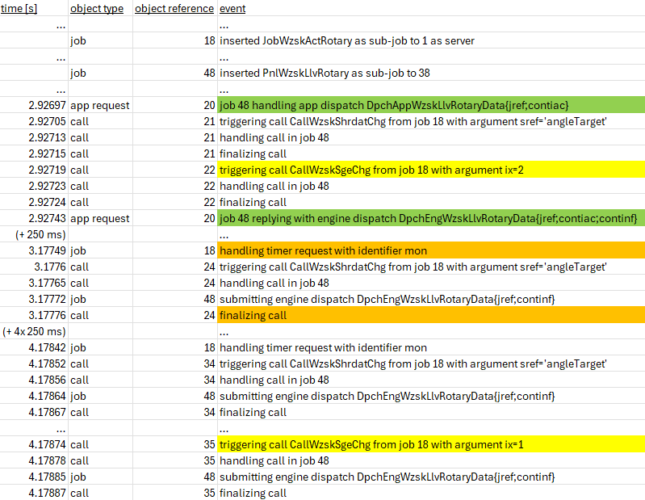
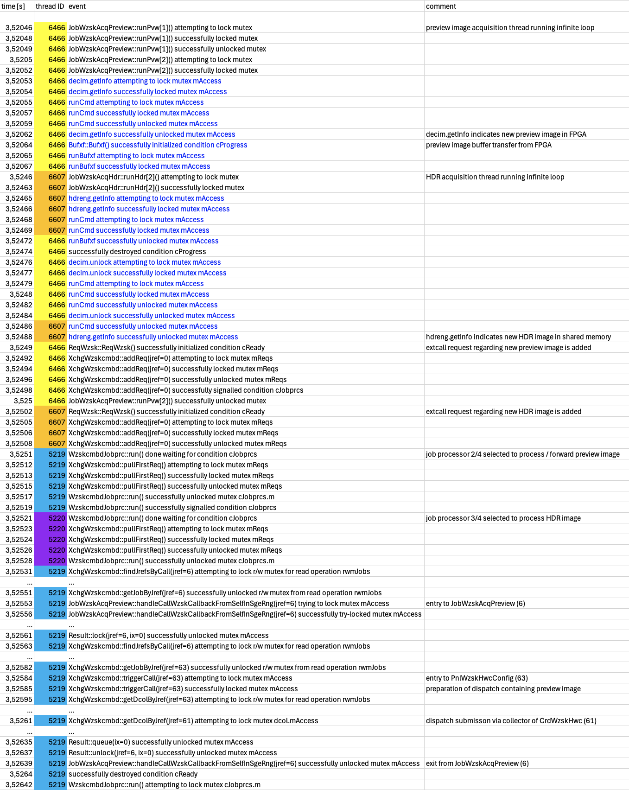
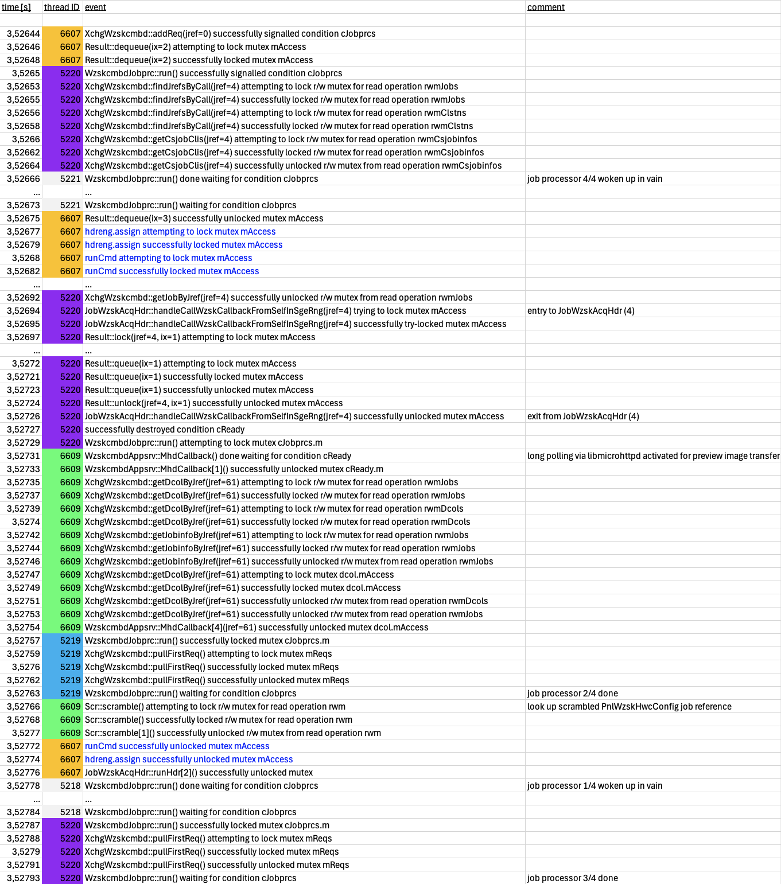
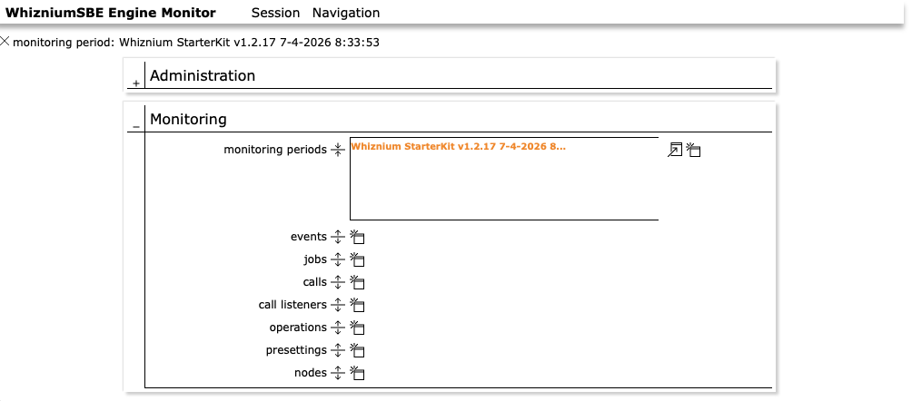
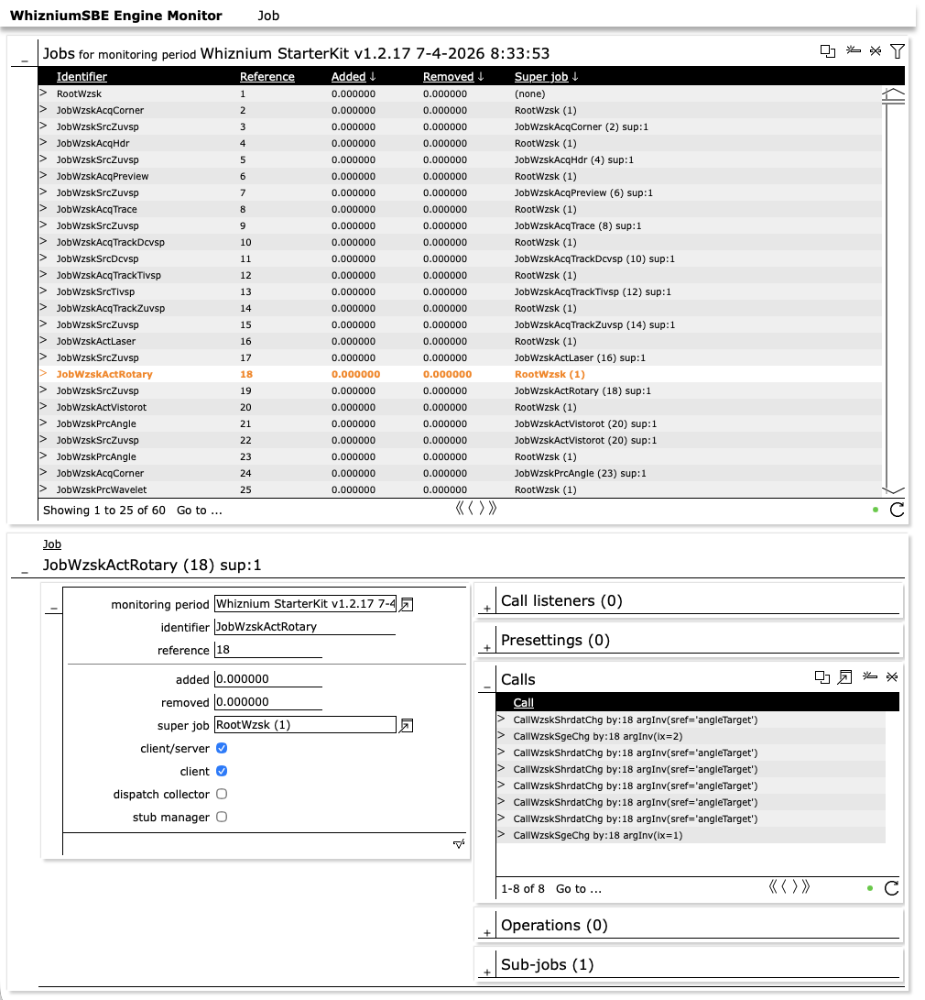
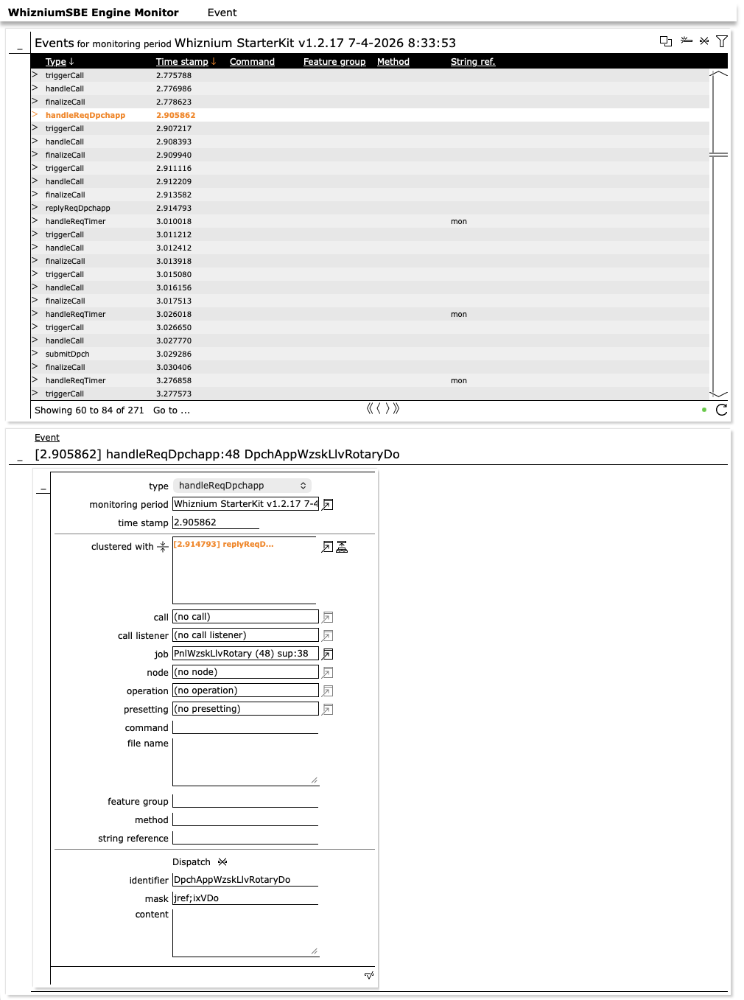

Daemon Command Line Debug (KB20)
================================

*Published: April 12, 2026*

*Highlights built-in daemon features to debug job-job interaction and multi-threading.*

*Categories: WhizniumSBE, Whiznium CV Demonstrator*

Source code file pointers: in \[1\] wzskcmbd/gbl/JobWzsk{AcqPreview, ActRotary}.{h, cpp}, wzskcmbd/Wzskcmbd.{h, cpp}; in \[3\] Mttypes.{h, cpp}

The methodical approach any WhizniumSBE-backed project follows, e.g. by using the *job tree* concept, also allows to track related events in a structured fashion. To this end, any project is equipped with monitoring features which are designed to only require (minimal) compute resources when enabled. By default off, starting/stopping is achieved through the daemin command line as shown in Figure 1.

*Figure 1: command-line standard command set with one occurrence each of event monitoring and multi-threading monitoring*

<b><u>Monitoring of events</u></b>

The scope of this feature is the run-time evolution of the job tree, interactions between jobs and reactions to outside stimuli such as web UI requests. Managed via the *{start/stop}Mon* standard commands, monitoring output is written to a tab-separated text file named *period\_\<timestamp\>.txt* in the executable's directory. The output is instantaneous (or non-buffered) such that events up to an eventual executable stall or crash can be captured reliably.

As can be seen in Figure 2, any monitoring period starts out with an initial snapshot of the job tree situation comprising jobs, call listeners, presettings and more (cf. KB5: Mastering the Job Tree). This is followed by the recording of time-stamped events which may also include modifications to the initial job tree: if, for example, a web UI card is closed, *remove* events for the corresponding jobs will be logged.

*Figure 2: log output at beginning and end of monitoring period*

Taking turntable movement as a CV demonstrator example, Figure 3 shows the sequence of events from web UI initiation to movement completion. Highlighted are a. the web UI request / reply pair after selecting a target position on the interactive dial in green, b. events following each 250 ms wakeup to monitor the movement progress in orange and c. the stage changes of *JobWzskActRotary* to *moving* (2) and back to *idle* (1) in yellow.

*Figure 3: log entries resulting from web UI triggered turntable movement*

<b><u>Monitoring of multi-threading</u></b>

A second type of monitoring focusses on multi-threading and lists corresponding run-time activity along with the thread ID. This is particularly helpful for identifying deadlocks and other unwanted conditions which occur irregularly only. Log files (naming convention *mtmon\_\<timestamp\>.txt*) are substantially larger compared to event logging, not least because already most events imply multiple condition and/or mutex operations.

The WhizniumSBE core library \[3\] provides lightweight wrappers around the POSIX mutex and condition types *pthread\_{cond/mutex}\_t*, namely *Cond*, *Mutex* and *Rwmutex*, the latter to implement a read/write mutex. On the one hand, they can be passed string identifiers upon construction; on the other hand, their member functions such as *lock()/unlock()* can be called with string parameters hinting at the context of the respective invocations. These strings in turn are used by the monitoring feature to provide textual context of individual operations.

Figures 4a-b show a typical scenario for the CV demonstrator with numerous threads at work simultaneously. Thread 6466 runs preview image acquisition, thread 6607 runs HDR image acquisition, threads 5218-5221 represent the pool of job processors, thread 6609 is responsible for web UI long polling.

*Figure 4a: typical multi-threading log entries (part 1/2), colors and comments added for clarity. Events rendered in blue concern FPGA subsystem calls.*

*Figure 4b: typical multi-threading log entries (part 2/2)*

<b><u>Extra: database-backed monitoring</u></b>

As an experimental feature, event logging to a SQL database is available. The corresponding relational database, as specified in \[2\] and shown in parts in Figures 5a-b, is well-suited to mirror the relations between job tree objects such as jobs and call listeners. It also allows to store clustering information of events that are mutually related. Database-backed monitoring is declared at the time of version stepping, by adding *dbsmon* to the version options (ixWOption) in the project's *IexWznmPrj* model file. The make files are then automatically updated to link the daemon executable to the *libdbswzem* database access library.

*Figure 5a: types of information gathered into SQL database tables during database-backed monitoring*

*Figure 5b: detail view of job information*

At run-time, on embedded systems where SQLite is the DBMS of choice, it is advisable to place the database file (typically *DbsWzem.sql*) on a memory-based / temporary file system as SQLite enforces strict file system *sync* after each SQL *INSERT*. As soon as one or multiple monitoring periods (again using the *{start/stop}Mon* commands) have been recorded, the populated database file can be transferred to a workstation for result evaluation. The corresponding tool is part of any Whiznium base installation at *\${WHIZROOT}/bin/wzemcmbd/Wzemcmbd*. By default, its web UI can be reached at port 14100.

Figure 6 shows as an example how above-mentioned turntable movement events are visualized in the database-backed version of monitoring.

*Figure 6: event for web UI commanded turntable movement request with clustered reply event*

As WhizniumSBE Engine Monitor is a WhizniumSBE-backed project, all currently available web UI components are the defaults auto-generated by WhizniumSBE based on the project's *IexWznmDbs* model file. For the future, more sophisticated, graphical timeline representations are envisioned.

\[1\] CV demonstrator Linux daemon <https://github.com/mpsitech/wzsk-Whiznium-StarterKit/tree/v1.2.16i>

\[2\] WhizniumSBE Engine Monitor <https://github.com/mpsitech/wzem-WhizniumSBE-Engine-Monitor/tree/v1.0.10i>

\[3\] WhizniumSBE core library <https://github.com/mpsitech/sbecore-WhizniumSBE-Core-Library/tree/v1.1.19>
