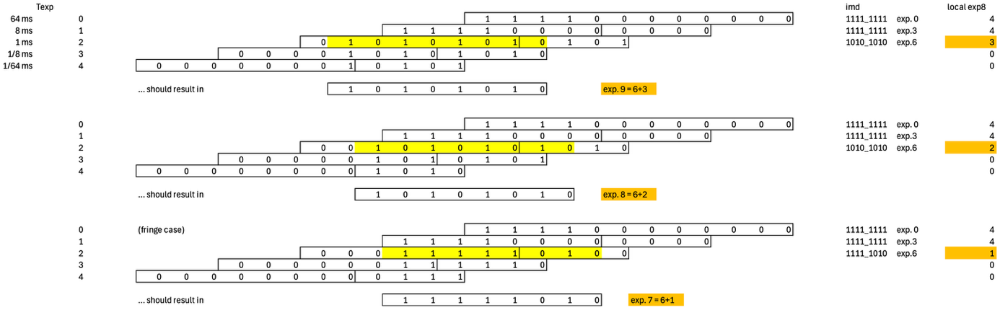
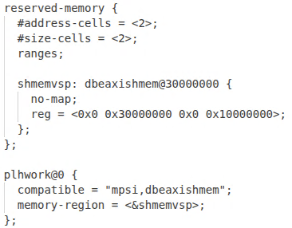

FPGA-based full-frame HDR image calculation in shared DDR memory space (KB3)
============================================================================

*Published: April 06, 2026*

*Highlights external memory inclusion and platform-specific implications.*

*Categories: WhizniumDBE, Whiznium CV Demonstrator*

Model and source code file pointers: in \[1\] \_mdl/IexWdbeMdl_wskd.xlsx, fpgawskd/{dcvsp, tivsp, zuvsp}/{Hdreng, Ddrif}.vhd; in \[2\] wzskcmbd/gbl/JobWzskAcqHdr.{h, cpp}

The ultimate rate of data exchange between CPU and FPGA subsystem in an FPGA-SoC is achieved by sharing a section of the system's DDR memory space. HDR image calculation is a perfect use case for this, as already the FPGA-based HDR algorithm must load and store MB-sized intermediate results that would not fit the internal block memory of mid-range FPGA-SoC's.

The RTL module *hdreng* handles the acquisition of five consecutive RGB frames, with each taken at one eighth the exposure time of the previous one. For 12 bits of dynamic range, this provides sufficient overlap to iteratively determine a 3x8 + 8 bit RGBE value for each pixel, where 'E' represents an exponent shared between the three base colors.

An example of how the common exponent is determined is shown in Figure 1: starting from the longest exposure time of 64 ms, a valid exponent is found when the MSB of the pixel value is zero, where the brightest out of R/G/B determines the outcome.

*Figure 1: Determination of common exponent, three different brightness levels*

A sophisticated row load/store algorithm using A/B pixel buffers mitigates the non-deterministic nature of DDR memory access, such that useful synchronization of stock pixel data from previous frames with live data of the current frame can be achieved. As the clock speed towards the DDR memory controller is higher than the pixel / system clock, clock domain crossings (CDC's) are implemented across the buffers, with WhizniumDBE auto-generating additional CDC logic for handshake signals.

In this context, the flexibility provided by the *ddrmux_Easy_v1_0* (DDR memory access multiplexer) module template, instantiated as *ddrif*, greatly simplifies implementation. While DDR memory access is achieved via AXI4 full in all three CV demonstrator variants, bus widths and allowed clock speeds vary. For instance, for the Efinix Titanium implementation with 512-bit wide data ports, the module template features integrated gearing to the 128-bit wide ports of *hdreng* and its buffers.

Regarding the shared memory space, management of active slots of the 12-item buffer is done CPU-side. For this purpose, the *JobWzskAcqHdr* job periodically invokes the *assign()* command of the RTL module *hdreng* to let it know which slot to write to *next*. As one full HDR acquisition takes at least 5x 33 ms = 167 ms, the timing of this assignment, performed in the *runHdr()* thread is not very critical. In other projects on similar platforms, successful scheduling of this type was achieved with \< 100 µs latency using standard Linux. In analogy to Example II, results can be locked by super-jobs of *JobWzskAcqHdr* for CPU-side processing. This feature is used for storing snapshot .RGBE files to SD card via *PnlWzskHwcConfig*. Templated WhizniumSBE *capabilities* assist in attaching a managed file archive to the project, providing auto-generated code for meta-data storage in the project's SQLite database and web UI file download.

<b><u>Extra: dbeaxishmem Linux kernel module</u></b>

Care has to be taken that the memory section shared between Linux and the FPGA subsystem is declared as reserved-memory in the device tree (example snippet shown in Figure 2) so it is excluded from both the kernel's global memory pool and the supervision of the cache controller.

*Figure 2: Device tree snippet for dbeaxishmem*

To finally enable user space applications to access the reserved memory region after mmap(), the simple *dbeaxishmem* out-of-tree kernel module is provided with WhizniumDBE.

\[1\] CV demonstrator RTL code and C++ access library <https://github.com/mpsitech/wskd-Whiznium-StarterKit-Device/tree/v1.2.15i>

\[2\] CV demonstrator Linux daemon <https://github.com/mpsitech/wzsk-Whiznium-StarterKit/tree/v1.2.16i>
