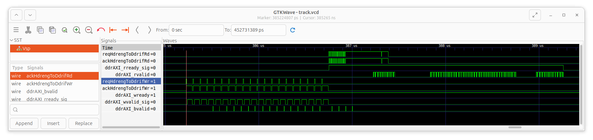
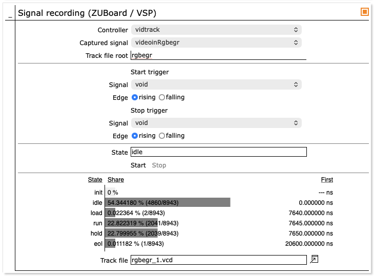
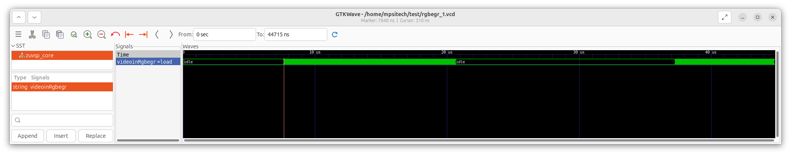
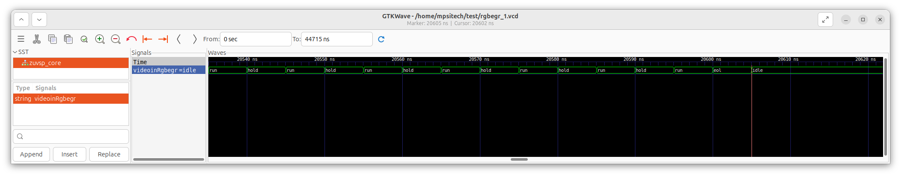

IP cores for vendor-agnostic design probing (KB4)
=================================================

*Published: April 08, 2026*

*Highlights the use of templates for signal-level debug outside of vendor IDE's.*

*Categories: WhizniumSBE, Whiznium CV Demonstrator, FPGA Vendors*

Model and source code file pointers: in \[1\] \_mdl/IexWdbe{Mdl,Fin}\_wskd.xlsx, fpgawskd/zuvsp/{Memtrack,Vidtrack}.vhd; in \[2\] wzskcmbd/gbl/JobWzskAcqTrackZuvsp.{h/cpp}, wzskcmbd/CrdWzskLlv/PnlWzskLlvTrackZuvsp.{h/cpp}; in \[3\] Track.{h/cpp}

Live probing of FPGA designs is a debug feature typically reserved for proprietary, black-box vendor IP, probed via JTAG and accessed from within their proprietary IDE's. This unnecessary vendor lock-in is overcome with the tracking *module templates* WhizniumDBE provides, complemented by the matching WhizniumSBE *capability* which allows interactive track acquisition control and read-out from Linux via web UI.

<b><u>General-purpose signal tracking</u></b>

A feature of interest for in-design signal probing within the CV Demonstrator's RTL code is the AXI interface connecting the *hdreng* module to DDR memory. In all FPGA-SoC variants, the DDR memory is shared with the device's CPU side which results in non-deterministic access patterns hard to capture in simulation.

To the end of probing the relevant AXI handshake signals, in the *IexWdbeMdl* model file, a module *memtrack* of type *gptrack_Easy_v1_0* is defined with clock source and top-level capture/trigger signals specified as parameters; up to 15 signals can be captured in parallel. An additional parameter *sizeSeqbuf* sets the size of the sequence buffer and thus the maximum duration of the trace. During acquisition, compression of clock cycles with no signal changes allows for efficient use of the corresponding vendor-agnostic on-FPGA RAM block.

Methods for decoding and decompressing the sequence buffer content can be found in \[3\]. The goal of tight integration with the CV demonstrator's run-time action is achieved by specifying the *JobWzskAcqTrack{Dcvsp/Tivsp/Zuvsp}* capabilities of type *dbetrack* in the *IexWznmGbl* model file, which results in *jobs* of the same names handling signal acquisition in their threads *runTrack*. Once complete, first decoding and writing to a .vcd file is triggered, followed by notification and update of the web UI panel shown in Figure 1.

*Figure 1: Web UI for general-purpose signal track acquisition*

The web UI panel hints at two more features: firstly, one capability can address multiple instances of *gptrack_Easy_v1_0* (and *fsmtrack_Easy_v1_0*, see below) with the *controller* to be chosen at runtime. Secondly, to extend the recording duration, signals toggling frequently without providing relevant insight can be masked, resulting in extend recording duration.

The generated .vcd file can be downloaded owing to WhizniumSBE's managed file archive capability. For the specific use case, typical traces of the relevant AXI handshake signals are shown in Figure 2. It becomes evident that write bursts are rather regular (except for the \_bvalid write-success confirmation!) but that read data is returned from the DDR memory controller with non-deterministic delay. This underpins the necessity for scheduling multiple read bursts without waiting for read completion, a feature that is neatly implemented in the *ddrmux_Easy_v1_0* module template, instantiated as *ddrif* in each variant's RTL project.

*Figure 2: GTKWave displaying AXI4 full handshake signals for DDR memory write-then-read for the HDR functionality at each end-of-line*

<b><u>FSM state tracking</u></b>

WhizniumDBE encourages the use of finite state machines (FSM's) as best practice. It offers fine-grained behavioral modeling as part of the *IexWdbeFin* model file where e.g. nested conditional state transitions can be specified. To track the state progression of FSM's relevant between *videoin* and *decim* (for preview image generation, cf. KB2), the *fsmtrack_Easy_v1_0* module template is instantiated as *vidtrack* in the *IexWdbeMdl* model file, with the FSM's to be monitored specified as module parameters. It is also required to change the *debug tap type* (ixVDbgtaptype) to *clust* for each of the concerned FSM's in the IexWdbeFin model file, exemplified here for the videoin.rgbegr (RGB egress) FSM. When an FSM *controller* is selected in the web UI panel and a capture is triggered, the display changes compared to above general-purpose signal case, as shown in Figure 3. Besides recording a .vcd trace, FSM state statistics are displayed which allow for quick validation of coverage and order of first occurrence.

*Figure 3: Web UI for FSM state track acquisition*

Figure 4a, on a microsecond timescale, shows the active/inactive periods of the FSM, confirming the 45 % / 55 % active vs. inactive split over a line's period. The close-up in Figure 4b, on a nanosecond timescale (the base clock is 200 MHz), highlights the intended "new-pixel-data-on-every-other-clock-cycle" nature of RGB egress action.

*Figure 4a: GTKWave displaying the RGB egress FSM states of the videoin module during 1+ lines*

*Figure 4b: GTKWave detail of the above in proximity of end-of-line*

\[1\] CV demonstrator RTL code and C++ access library <https://github.com/mpsitech/wskd-Whiznium-StarterKit-Device/tree/v1.2.15i>

\[2\] CV demonstrator Linux daemon <https://github.com/mpsitech/wzsk-Whiznium-StarterKit/tree/v1.2.16i>

\[3\] WhizniumDBE core library <https://github.com/mpsitech/dbecore-WhizniumDBE-Core-Library/tree/v1.1.51>
