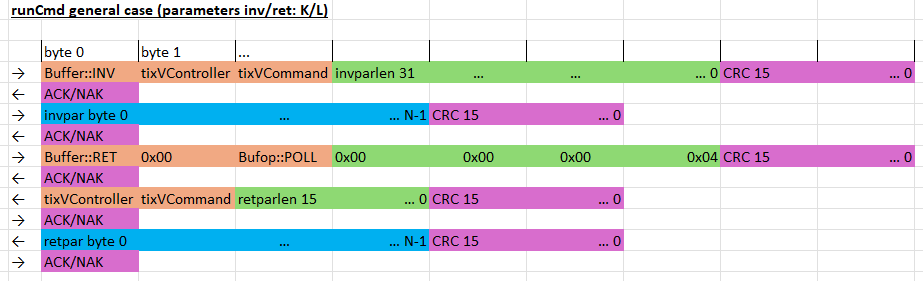
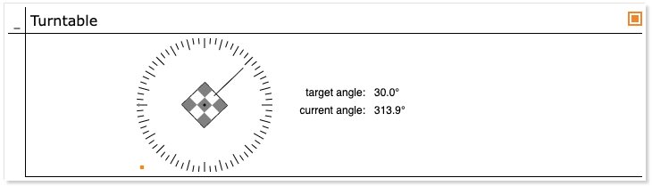

Mastering the Job Tree (KB5)
============================

*Published: April 13, 2026*

*Highlights key concepts of the run-time job hierarchy including calls and dispatches.*

*Categories: WhizniumSBE, Whiznium CV Demonstrator*

Model and source code file pointers: in \[1\] \_mdl/IexWznm{Job, Jtr}\_wzsk.xlsx, wzskcmbd/Wzskcmbd.{h, cpp}, wzskcmbd/gbl/JobWzsk{SrcTivsp, AcqPreview, AcqTrackTivsp, ActRotary}.{h, cpp}, wzskcmbd/CrdWzskHwc/PnlWzskHwcConfig.cpp, wzskcmbd/CrdWzskLlv/PnlWzskLlv{Rotary, TrackTivsp}.cpp

Any Embedded System development mandates clearly defined software responsibilities for control and observation of hardware features. The CPU-side *job tree* is a foundational WhizniumSBE concept which helps organizing firmware functionality accordingly. It encourages kicking off the design process by modeling the functionality into a fine-grained hierarchy of *jobs*, with each job resulting in a dedicated C++ class and source code file. For the CV demonstrator (Efinix Titanium variant), a run-time situation is exemplified in Figure 1, with reference numbers as unique identifiers in parentheses. Super jobs *#include* their sub-jobs and can access their functionality directly. In addition, sophisticated thread-safe inter-job call passing is part of every WhizniumSBE-backed design.

*Figure 1: CV demonstrator job tree (slightly shortened) with jobs relevant for examples I-III highlighted in color; stages in gray for jobs with attached state machines*

According to the above, on the one hand each hardware-controlling job should exist only once in controlling fashion, while on the other hand there can be multiple super-jobs requiring their functionality as sub-jobs. This contradiction is resolved by instantiating each hardware-controlling job once in server mode and multiple times in client mode - this is denoted as /SRV and /CLI, respectively, in Figure 1. Only the server instance actively performs operations on hardware, for example by holding file descriptors and allocated memory while relaying requests and results to client instances.

FPGA subsystem access is achieved, for the Efinix Titanium variant of the CV demonstrator, by instantiating the job *JobWzskSrcTidvk*. It funnels all command invocations and buffer transfers through a single character device, */dev/dbeaxilite0*. To allow mutually independent super-jobs, such as *JobWzskActLaser* for line laser control and *JobWzskActRotary* for turntable control, to gain access to only a portion of the FPGA subsystem, the concept of *claims* is implemented, along with thread-safe handling methods. For the CV demonstrator, the derived class *Wzsk::ClaimVsp* is used; with it, at any given time, exactly one super-job can claim controlling access of either of the domains *corner/decim/hdreng/laser/step/trace/track*. In an alternative implementation, multiple WhizniumDBE-backed IP cores, one for each domain, could be attached to the system.

Also visible in Figure 1 are web UI session related jobs, which can be present multiple times in the job tree and which are not subject to the server / client construct of hardware control jobs. Specifically, under the user session *SessWzsk (33)*, handler jobs for *cards* - each card corresponds to one browser tab in the web UI - and *panels* are listed.

<b><u>Example I: turntable movement</u></b>

A user-commanded turntable movement is implemented via the job tree path *PnlWzskLlvRotary - JobWzskActRotary - JobWzskSrcTivsp*, where *JobWzskActRotary* controls the move operation with the help of an attached state machine.

*Figure 2: interactive web UI panel for low-level turntable positioning*

After the user selects a position on the web UI turntable dial depicted in Figure 2, a dispatch *DpchAppWzskLlvRotaryData* with the target position arrives in *PnlWzskLlvRotary*. It direct-invokes the moveto() member of *JobWzskActRotary* which in turn first issues a *moveto()* command to the FPGA subsystem via *JobWzskSrcTivsp* and then receives periodical wakeup calls at which it tracks the progress, using polling and *getInfo()*, until done. *JobWzskActRotary* also serves as hardware abstraction layer (HAL): depending on the CV demonstrator hardware configured, it instantiates *JobWzskSrcDcvsp* (Microchip PolarFire SoC) or *JobWzskSrcZuvsp* (AMD MPSoC) instead of *JobWzskSrcTivsp* (Efinix Titanium), without changing the API towards its super-jobs.

<b><u>Example II: preview image acquisition and display</u></b>

For the display of preview images in the web UI, the job tree path is *PnlWzskHwcConfig - JobWzskAcqPreview - JobWzskSrcTivsp*, with *JobWzskAcqPreview* handling the actual configuration and acquisition from whichever underlying hardware is connected. Multiple stakeholders (e.g. from multiple web UI sessions) can receive the acquisition results, but only one configuration, e.g. grayscale vs. RGB is possible, submitted by one of these stakeholders. To this end, the *claim* concept mentioned above is extended to include corresponding parameters. The eventual state machine change from idle to running and vv. is determined in *handleClaim()* based on the list of claims presented to *JobWzskAcqPreview*.

While running, *JobWzskAcqPreview* continuously delivers preview images through a two-element *result* queue, another core element of WhizniumSBE which allows mutex-protected sharing of data between jobs. Any time a new result is ready, a *CallWzskResultNew* is triggered which reaches *PnlWzskHwcConfig* that is listening on this call. *Call listeners* are typically established in a job's constructor and can be specified with fine-grained filters, regarding e.g. the origin of the calls to be matched.

<b><u>Example III: signal track acquisition</u></b>

In terms of job tree organization, signal track acquisition is very similar to the previous example with the key difference that it is "single-shot", i.e. *JobWzskAcqTrackTivsp* falls back into stage *idle* after a single result of type *Wzsk::ResultitemDbetrack* has been populated. The job tree path is *PnlWzskLlvTrackTivsp - JobWzskAcqTrackTivsp - JobWzskSrcTivsp*, and *JobWzskSrcTivsp* operation is is initiated by *PnlWzskLlvTrackTivsp* invoking *XchgWzsk::addCsjobClaim()*, with an *Wzsk::ClaimDbetrack* object as argument, holding acquisition parameters. No HAL is used here as all three job classes involved contain hardware-specific functionality.

<b><u>Extra: the exchange object</u></b>

At the core of each WhizniumSBE project sits the exchange object, *Xchg(cmbd)Wzsk* in case of the CV demonstrator. From each job it can be accessed via the member variable *xchg*. Its thread-safe methods have been refined over many years and have proven their robustness across countless real-life applications.

Its relevant methods are grouped into these main sections:

- Monitoring: this debug feature with minimal overhead allows to capture events passing through the exchange object (which should be all relevant interactions with job objects, if the project follows WhizniumSBE best practices) into either a tab-separated text file or into an attached SQL database.

- Requests: all external triggers, e.g. from the web UI, the command line, or connected operation engines, result in these atomic work units. Additionally, wakeups (see below) result in requests once they expire. All idle job processor threads are waiting for new requests to be added, allowing for high-performance parallel operation.

- Operations: WhizniumSBE projects provide the infrastructure to let separate executables, so-called operation engines, perform atomic remote procedures upon invocation from the main executable aka. engine. This feature is less relevant in the Embedded context than in datacenter applications.

- Presettings: these are variables of basic data types which can be set / reset and attached to jobs. They can be queried up the job structure, allowing to set a context for entire branches of the job tree.

- Stubs: a relational SQL database is part of every WhizniumSBE project. The stub manager feature provides a cache for human-readable representations of table records, minimizing SQL lookup which is particularly useful for large web UI list views. Stubs can refer to other stubs and are optionally localized (multi-language).

- Calls: brokerage of these notifications, both inter-job and jobs to stub managers and to the M2M handler threads, is key for efficient operation. The methods of this section register new call listeners and match triggered calls with call listeners.

- Dispatch collectors: the long polling feature of the web UI requires these buffers, which can be attached to a session or to each card hierarchically below in the job tree. Dispatch collectors store and update unsent engine-to-app dispatches while there is no pending request from the app.

- Jobs: jobs are classes within the engine which are responsible for specific functionality. At run-time, there is one root job object, one session job per session, HMI jobs for each card/panel/dialog/query currently active, and for arbitrary / hardware functionality. Crucial functionality is implemented here, e.g. to ensure the correct addition of jobs and hierarchical removal of job tree branches.

- Client/server jobs: this special type of job is used mainly for hardware control, where the server is the \"acting\" instance relaying its operation to multiple client instances. Also, the claim functionality, ensuring well-defined feature access, is handled in the associated methods.

- Wakeups: features requiring periodic updates use this feature to allow the job processor threads to proceed on other tasks during the wait period, thus avoiding calls to *sleep()*. Wakeups with zero wait period are used to switch from e.g. the dedicated acquisition threads of the Whiznium CV demonstrator to the job processor threads, or to reply to a web UI request immediately while kicking off long-duration activity within the engine.

Additionally, through the exchange object's member variables, easy access to settings, read from the application's XML preferences file is provided.

<b><u>Extra: job access</u></b>

Each job maintains two main entry points, *handleCall()* and *handleRequest()*: the former is reached from the exchange object's *triggerCall()* method when one of the job's call listeners is matched to a triggered call, and the latter is invoked from a job processor's *accessJob()* method if a request is found to concern the job.

To achieve thread-safety, every job is equipped with a mutex, *mAccess*. While call listeners are created with the *job access type* attribute *lock/trylock/weak*, resulting in the corresponding mutex behavior, requests (with few exceptions) enforce locking the job's mutex before invoking its *handleRequest()* method.

Using *PnlWzskLlvRotary* as an example, handled calls include *CallWzskClaimChg* (claim \[status\] change), *CallWzskSgeChg (stage change)*, *CallWzskShrdatChg* (shared data, e.g. angle, change), all regarding the panel's *actrotary* sub-job. Each call has its separate handler method. A similar pattern applies to requests; there are no command-line commands specified which leaves *PnlWzskLlvRotary* sensitive to requests from the web UI and the corresponding app-to-engine dispatches *DpchAppWzskInit* (initial request for all of the panel's XML data blocks), *DpchData* (interactive content update), *DpchDo* (any button click).

\[1\] CV demonstrator Linux daemon <https://github.com/mpsitech/wzsk-Whiznium-StarterKit/tree/v1.2.16i>
