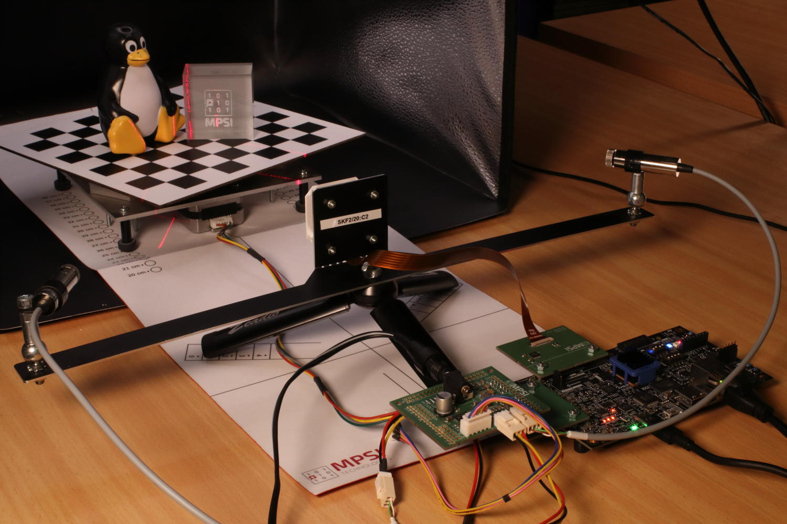
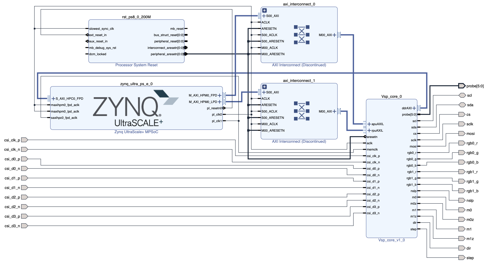
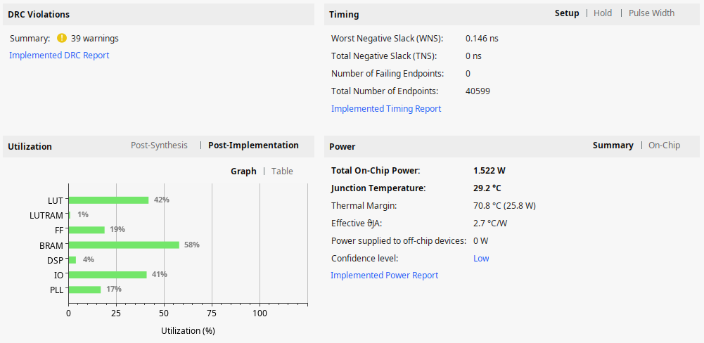

AMD MPSoC variant (KB6)
=======================

*Published: April 14, 2026*

*Highlights the platform-specifics and build instructions for Avnet\'s ZUBoard.*

*Categories: Whiznium CV demonstrator, FPGA vendors*

<b><u>Overview</u></b>

The ZUBoard [1], featuring AMD's lowest density 1CG Zynq UltraScale+ MPSoC, is a popular choice for prototyping FPGA-SoC designs. At relatively low cost (\< USD 200), it provides high-speed access to custom peripherals via its SYZYGY connectors, as well as all standard Single-Board Computer (SBC) outlets, such as Ethernet and a microSD card slot.



*Figure 1: CV demonstrator based on ZUBoard in action*

Parts specific to this variant and provided with the delivery, include:

- the Syzcam2 adapter PCB bringing the IMX335 camera module's 4+1 MIPI lanes routed as differential pairs, and its I2C, to a SYZYGY Transceiver connector.

- the Syzpmod2 adapter PCB which translates 2x8 GPIO's from PMOD to SYZYGY Standard.

- the Skpph2 PCB with populated PMOD connectors, which drives the CV demonstrator's stepper motor and line lasers from its own power supply.

- a USB-C power supply for the ZUBoard.

- a 12 V / 2 A power supply for Skpph2 with 5.5/2.5 mm barrel connector.

- a micro USB cable to access the MPSoC's serial console.


<b><u>Quick start</u></b>

The hardware setup needs to be established as depicted above, with the boot mode switches set to 0101 and J1 in the 1.2 V position. A ready-to-use 16 GB microSD card image can be obtained and flashed using the commands

```
wget https://content.mpsitech.cloud/artefacts/zudvk_wzsk_v1.2.16_wskd_v1.2.15_SD_16GB.img.gz
sudo gunzip -c zudvk_wzsk_v1.2.16_wskd_v1.2.15_SD_16GB.img.gz | dd of=/dev/sda bs=64K
```

With the microSD card inserted into ZUBoard's slot, and both power supplies connected, SW7 initiates the system boot into Linux. A successful boot is accompanied by RGB LED D4 pulsating. The image is configured for DHCP such that SSH into the board is possible. The command-line terminal for low-level RTL access and the CV demonstrator daemon are started with

```
cd /home/root/whiznium/bin/wskdterm
./Wskdterm zuvsp /dev/dbeaxilite0
```

and

```
cd /home/root/whiznium/bin/wzskcmbd
./Wzskcmbd
```

respectively. After the daemon is started, its web UI can be reached at http://192.168.178.99:13100, where 192.168.178.99 is the assumed IP address attributed by DHCP, with wzskuser / asdf1234 being the default credentials.


<b><u>VSP core Vivado workflow</u></b>

Vivado 2024.2 has been used to run the RTL workflows from code to bitstream. The project for the ZUBoard vsp_core ("video signal processing core") is avalilable online: <a href="https://content.mpsitech.cloud/projects/zudvk_vsp_core_v1.2.15.tgz" target="_blank">zudvk_vsp_core_v1.2.15.tgz</a>.

Key aspects of this variant's implementation include:

- Camif.vhd instantiates the AMD MIPI CSI-2 Receiver Subsystem (cf. PG232) configured to 4+1 MIPI lanes with 1188 Mbps. This allows the IMX335 to deliver its native resolution of 2592 x 1944 pixels at 30 fps. Direct application of 200 MHz master clock as restored pixel data clock with the IP core's AXI-4 Stream output filtered to only consider the RAW12 data type. Data of two adjacent pixels (24-bit words) is delivered towards videoin on each clock cycle.

- Videoin.vhd delivers one RGB/grayscale value every other clock cycle at 1296 x 972 resolution.

- Decim.vhd features a 38 kB dual-port BRAM which results in 6 x 6 binning for grayscale and 10 x 10 binning for RGB.

- Hdreng.vhd / Ddrif.vhd: using fMemclk = 250 MHz on the 128-bit AXI-4 interconnect allows for a theoretical bandwidth of 4 GB/s; load and store operation is handled via 128-bit:64-bit dual-port BRAM's serving as CDC interface as well.

- Hostif.vhd: the PS-PL AXI-4 Lite interconnect is 64 bits wide which is also the bus width for all connected buffers to be read from the host.


<b><u>Top-level Vivado workflow</u></b>

A straightforward top-level block design has been put together to wire up the VSP core to the MPSoC's processing system, as shown in Figure 2. It is available for download: <a href="https://content.mpsitech.cloud/projects/zudvk_wskd_v1.2.15.tgz" target="_blank">zudvk_wskd_v1.2.15.tgz</a>. Visible are the discrete vsp\_core I/O's promoted to top level, the PS-PL connection HPM0 which uses AXI4-Lite for core control from the CPU (base address 0x20\_0000\_0000) and the PL-PS connection HPC0 which allows the core to access the 256 MB:128 MB:384 MB section of the ZUBoard's 1 GB DDR memory. No RTL sources are required for the top-level design besides the HDL wrapper auto-maintained by Vivado.



*Figure 2: Vivado block design*

The resulting resource utilization is shown in Figure 3.



*Figure 3: Resource utilization*

<b><u>PetaLinux (Yocto) Workflow</u></b>

A standard PetaLinux 2024.2 workflow is used to first create the Linux boot and root file system artefacts and then the SDK, inside of which the CV demonstrator's WhizniumSBE project is compiled. Full instructions are not given here but indications on how this workflow is accomplished can be found here <https://github.com/mpsitech/The-Whiznium-Documentation/blob/main/setup_peta.md>. The required subfolder for the PetaLinux / Yocto build, containing the project specifics, is available online: <a href="https://content.mpsitech.cloud/projects/zudvk_wzsk_v1.2.16_project_spec.tgz" target="_blank">zudvk_wzsk_v1.2.16_project_spec.tgz</a>. It contains the relevant out-of-tree device drivers as well as the device tree.


[1] Tria Technologies ZUBoard 1CG <https://www.tria-technologies.com/product/zuboard-1cg>, retrieved on April 14, 2026
