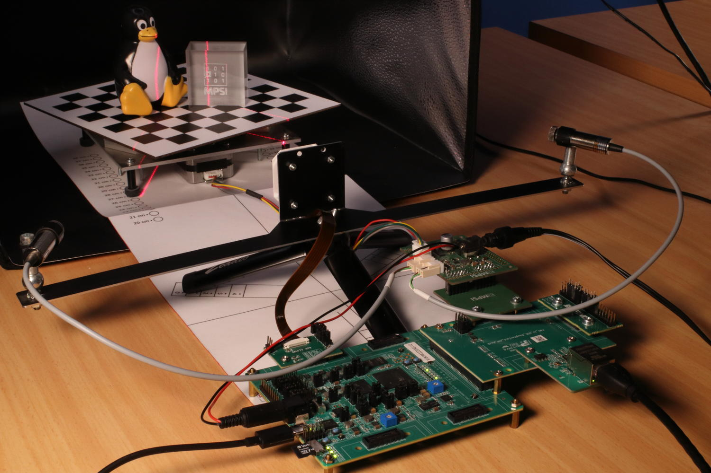

Efinix Titanium variant (KB7)
=============================

*Published: official date pending*

*Highlights the platform-specifics and build instructions for Efinix\'s Ti180 dev kit.*

*Categories: Whiznium CV demonstrator, FPGA vendors*

<b><u>Overview</u></b>



*Figure 1: Hardware setup in action*

<b><u>Quick Start</u></b>

```
wget https://content.mpsitech.cloud/artefacts/titdvk_wzsk_v1.2.16_wskd_v1.2.15_SD_16GB.img.gz
sudo gunzip -c titdvk_wzsk_v1.2.16_wskd_v1.2.15_SD_16GB.img.gz | sudo dd of=/dev/sda bs=64K
```

<a href="https://content.mpsitech.cloud/artefacts/titdvk_wzsk_v1.2.16_wskd_v1.2.15_ti180-tsemac-linux.hex" target="_blank">titdvk_wzsk_v1.2.16_wskd_v1.2.15_ti180-tsemac-linux.hex</a>,
<a href="https://content.mpsitech.cloud/artefacts/titdvk_wzsk_v1.2.16_wskd_v1.2.15_jtag_spi_flash_loader_dual.bit" target="_blank">titdvk_wzsk_v1.2.16_wskd_v1.2.15_jtag_spi_flash_loader_dual.bit</a>

<b><u>VSP Core Efinity Workflow</u></b>

<a href="https://content.mpsitech.cloud/projects/titdvk_vsp_core_v1.2.15.tgz" target="_blank">titdvk_vsp_core_v1.2.15.tgz</a>

<b><u>Top-level Efinity Workflow</u></b>

<a href="https://content.mpsitech.cloud/projects/titdvk_ti180-tsemac-linux_v1.2.15.tgz" target="_blank">titdvk_ti180-tsemac-linux_v1.2.15.tgz</a>

<b><u>Buildroot Workflow</u></b>

<a href="https://content.mpsitech.cloud/projects/titdvk_wzsk_v1.2.16_br2-efinix-ext-ethernet.tgz" target="_blank">titdvk_wzsk_v1.2.16_br2-efinix-ext-ethernet.tgz</a>


<b><u>OLD FROM HERE</u></b>

The Efinix Titanium Ti180 is a fabric-only device which, by using the Sapphire SoC IP, can be configured to include up to RISC-V soft cores capable of running Linux. Its development kit complements it with DDR memory, JTAG and a microSD card slot, furthermore the device's hardened MIPI interfaces are made available through ...

is aThe ZUBoard, featuring the AMD's lowest density 1CG Zynq UltraScale+ MPSoC, is a popular choice for prototyping FPGA-SoC designs. At relatively low cost (\< USD 200), it provides high-speed access to custom peripherals via its SYZYGY connectors, as well as all standard Single-Board Computer (SBC) outlets, such as Ethernet and a microSD card slot.

Syzcam2 adapter PCB for 4+1 MIPI lanes routed as differential pairs, level shifters for I2C

Syzpmod2 adapter PCB for 2x8 GPIO's ... connecting to skpph2 with power supply to the stepper motor only, the ZUBoard is powered via USB-C

Quick start

The SD card .wic image is available at ...

It can be flashed to a microSD card using

umount /dev/sda\*

dd if=xxx.wic of=/dev/sda bs=4M

Where /dev/sda is to be replaced with the path to which the microSD card is mounted.

The full hardware assembly is depicted in Figure xx. A standard 12 V power supply with 5.5/2.5 mm barrel connector supplies skpph2 and a USB-C supply powers the ZUBoard. Make sure that the boot mode switches are set to 0101 and that J1 is in the depicted 1.2 V Vio position.

Upon pressing the button, the system will boot with output shown on the serial console (settings 115200N1), the default login is root/root. No DHCP is configured, an IP address can be set using

ifconfig eth0 192.168.1.99

From this point onwards, the system can be accessed via SSH.

The relevant executables are located in /home/root/whiznium/bin/wskdterm and /home/root/whiznium/bin/wzskcmbd, respectively.

For the former, typical output looks like this

Whereas for the latter, this command line shows

And in addition, an internal web server is started such that control over the device can be achieved interactively by browsing the address

<b><u>[http://192.168.1.99:13100</u></b>](http://192.168.1.99:13100/)

Gateware

The Vsp\_core's key features of

Camif: instantiates AMD MIPI CSI-2 Receiver Subsystem (cf. PG232) configured to 4+1 MIPI lanes with 1188 Mbps. This allows the IMX335 to deliver its native resolution of 2592 x 1944 pixels at 30 fps. Direct application of 200 MHz clock as restored pixel data clock with the IP core's AXI-4 Stream output filtered to only consider RAW12 data type. Data of two adjacent pixels (24-bit words) is delivered towards videoin on each clock cycle

Videoin: delivers one RGB/grayscale value every other clock cycle at 1296 x 972 resolution

Decim: features a 38 kB DPBRAM which results in edge sizes of xxx for grayscale and xxx for RGB.

Hdreng/Ddrif: using fMemclk = 250 MHz on the 128-bit AXI-4 interconnect allows for a theoretical bandwidth of 4 GB/s; load and store operation is handled via 128-bit:64-bit DPRAM's implementing serving as CDC interface as well

Hostif: the PS-PL AXI-4 Lite interconnect is 64 bits wide which is also the bus width for all connected buffers to be read from the host

A straightforward block design, shown in Figure XXX, has been put together in Vivado 2024.2. Visible are the discrete vsp\_core I/O's promoted to top level, the PS-PL connection HPM0 which uses AXI4-Lite for core control from the CPU (base address 0x20\_0000\_0000) and the PL-PS connection HPS0 which allows the core to access the 256 MB:128 MB:384 MB section of the ZUBoard's 1 GB DDR memory. No RTL sources are required for the top-level design in addition to the auto-maintained HDL wrapper provided by Vivado.

Resource utilization is shown in Figure XXX.

Memory map \...

Bring-up from sources

Two separate Vivado 2024.2 projects are available online, one for the Vision Processor IP core vsp\_core and one for the top-level project embedding it wskd. Bitstream generation is straightforward.

... https://content.mpsitech.cloud/kb6/wskd1.0.3/wskd.tgz, vsp\_core.tgz

As for the PetaLinux 2024.2 project (PetaLinux being a wrapper for Yocto ... / Bitbake ... in this case), the relevant configuration can be found at

... https://content.mpsitech.cloud/kb6/wskd1.0.3/project-spec.tgz

It can be built and deployed in the standard way detailed in \[1\].
