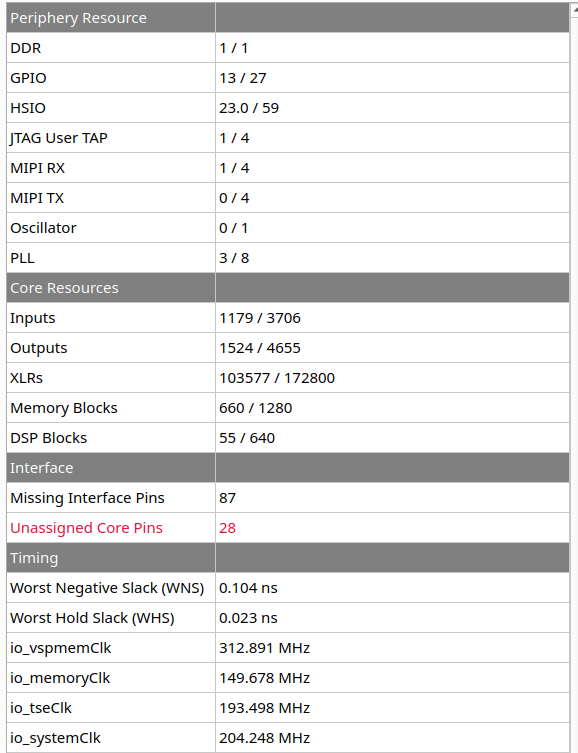

Efinix Titanium variant (KB7)
=============================

*Published: April 14, 2026*

*Highlights the platform-specifics and build instructions for Efinix\'s Ti180 dev kit.*

*Categories: Whiznium CV demonstrator, FPGA vendors*

<b><u>Overview</u></b>

The Efinix Titanium Ti180 is a fabric-only device which, by using the Sapphire SoC IP, can be configured to include up to four 32-bit RISC-V soft cores capable of running Linux. Its development kit [1] complements the SoC chip with DDR memory, JTAG and a microSD card slot. Additionally, the device's hardened MIPI interfaces as well as Ethernet are made available through Efinix-provided adapter boards.


*Figure 1: CV demonstrator based on Efinix Ti180 dev kit in action*

Parts specific to this variant ans provided with the delivery, include:

- the Qtepmod2 adapter PCB which translates 2x8 GPIO's from PMOD to the custom Samtec QTE connector found on the Efinix breakout board.

- the Skpph2 PCB with populated PMOD connectors, which drives the CV demonstrator's stepper motor and line lasers from its own power supply, which is also forwarded via cable to the dev kit.

- a 12 V / 2 A power supply for Skpph2 with 5.5/2.5 mm barrel connector.

- a USB-C cable to access the JTAG chain and the Sapphire SoC's serial console


<b><u>Quick start</u></b>

The hardware setup needs to be established as depicted above. First-stage boot loader and FPGA configuration are to be programmed into the dev kit's dedicated SPI NOR Flash memory which is accomplished through the Efinity Programmer tool. Two binary files are reuqired for this, the first representing the project bitstream and the second (provided by Efinix as part of [2]) required to make the JTAG programming work. Both are available for download: <a href="https://content.mpsitech.cloud/artefacts/titdvk_wzsk_v1.2.16_wskd_v1.2.15_ti180-tsemac-linux.hex" target="_blank">titdvk_wzsk_v1.2.16_wskd_v1.2.15_ti180-tsemac-linux.hex</a> and 
<a href="https://content.mpsitech.cloud/artefacts/titdvk_wzsk_v1.2.16_wskd_v1.2.15_jtag_spi_flash_loader_dual.bit" target="_blank">titdvk_wzsk_v1.2.16_wskd_v1.2.15_jtag_spi_flash_loader_dual.bit</a>.

A ready-to-use 16 GB microSD card image can be obtained and flashed using the commands

```
wget https://content.mpsitech.cloud/artefacts/titdvk_wzsk_v1.2.16_wskd_v1.2.15_SD_16GB.img.gz
sudo gunzip -c titdvk_wzsk_v1.2.16_wskd_v1.2.15_SD_16GB.img.gz | dd of=/dev/sda bs=64K
```

With the microSD card inserted into dev kit's slot, the power supply connected and PSW1 in the "on" position, SW2 initiates the system boot into Linux. A successful boot is accompanied by LED3 pulsating. The image is not configured for DHCP such that in a serial console (credentials root / root) the _./init.sh_ command needs to be executed. It probes out-of-tree kernel modules and establishes the system at 192.168.178.21, which can of course be modified in the script as needed.

After this step, SSH into the board is possible. The command-line terminal for low-level RTL access and the CV demonstrator daemon are started with

```
cd /root/whiznium/bin/wskdterm
./Wskdterm tivsp /dev/dbeaxilite0
```

and

```
cd /root/whiznium/bin/wzskcmbd
./Wzskcmbd
```

respectively. After the daemon is started, its web UI can be reached at http://192.168.178.21:13100, with wzskuser / asdf1234 being the default credentials.


<b><u>VSP Core Efinity Workflow</u></b>

Efinity 2025.1 has been used to run the RTL workflows from code to bitstream. The project for the Ti180 dev kit vsp_core ("video signal processing core") is avalilable online: <a href="https://content.mpsitech.cloud/projects/titdvk_vsp_core_v1.2.15.tgz" target="_blank">titdvk_vsp_core_v1.2.15.tgz</a>.

Key aspects of this variant's implementation include:

- Camif.vhd embeds the Efinix MIPI 2.5G CSI-2 RX Controller configured to 4+1 MIPI lanes with 1188 Mbps. This allows the IMX335 camera module to deliver its native resolution of 2592 x 1944 pixels at 30 fps. In a first stage, camif synchronizes the controller's output clock and data to the design's master clock of 200 MHz, filtering for RAW12 data. Data of two adjacent pixels (24-bit words) is delivered towards videoin on each clock cycle.

- Videoin.vhd delivers one RGB/grayscale value every other clock cycle at 1296 x 972 resolution.

- Decim.vhd features a 32 kB dual-port BRAM which results in 7 x 7 binning for grayscale and 11 x 11 binning for RGB preview images.

- Hdreng.vhd / Ddrif.vhd: using fMemclk = 250 MHz on the "extra-wide" 512-bit AXI-4 interconnect allows for a theoretical bandwidth of 16 GB/s which is however not matched by the physical design in practice; load and store operation is handled via 512-bit:64-bit dual-port BRAM's serving as CDC interface as well.

- Hostif.vhd: the PS-PL AXI-4 Lite interconnect is 32 bits wide which is also the bus width for all connected buffers to be read from the host.


<b><u>Top-level Efinity Workflow</u></b>

The top-level design is a heavily modified version of a special Efinix Ti180 dev kit out-of-the-box design [3] which makes the triple-speed Ethernet available to use from within Linux (it is provided by Efinix on request). The instantiation and wiring of vsp_core is achieved in its top-level Verilog file _top_ti180.v_. The full Efinity project is available for download: <a href="https://content.mpsitech.cloud/projects/titdvk_ti180-tsemac-linux_v1.2.15.tgz" target="_blank">titdvk_ti180-tsemac-linux_v1.2.15.tgz</a>.

The resulting resource utilization is shown in Figure 2.



*Figure 2: Resource utilization*

<b><u>Buildroot Workflow</u></b>

A standard Buildroot 2021.1 workflow is used to first create the Linux boot and root file system artefacts and then the SDK, inside of which the CV demonstrator's WhizniumSBE project is compiled. Full instructions are not given here but can be obtained from various online sources. The required out-of-tree component for the Buildroot build, modified from [2], is available online: <a href="https://content.mpsitech.cloud/projects/titdvk_wzsk_v1.2.16_br2-efinix-ext-ethernet.tgz" target="_blank">titdvk_wzsk_v1.2.16_br2-efinix-ext-ethernet.tgz</a>. It contains the relevant out-of-tree device drivers as well as the device tree.


[1] Efinix Titanium Ti180 M484 Development Kit <https://www.efinixinc.com/products-devkits-titaniumti180m484.html>, retrieved on April 14, 2026

[2] Efinix Buildroot 2021.1 <https://github.com/Efinix-Inc/br2-efinix>, retrieved on April 14, 2026

[3] Efinix Ti180 Development Kit Design <https://www.efinixinc.com/support/ed/ti180j484-demo-design.php>, retrieved on April 14, 2026
