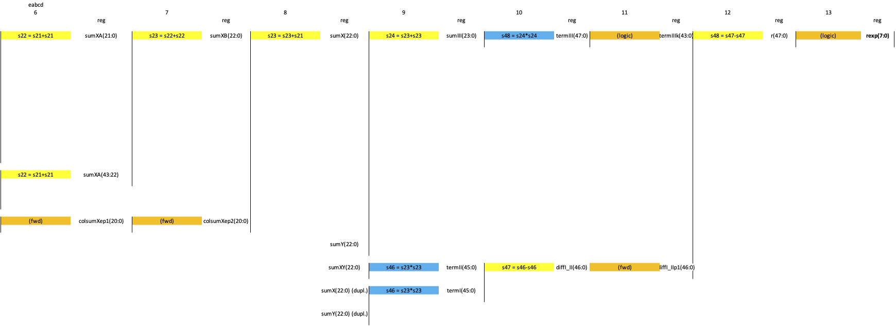

Pipelined Corner Detection Algorithm (KB9)
==========================================

*Published: official date pending*

*Highlights pipelined and parallel execution, a key FPGA strength.*

*Categories: WhizniumDBE, Whiznium CV Demonstrator*

Model and source code file pointers: in \[1\] \_mdl/IexWdbeFin_wskd.xlsx, ezdevwskd/UntWskdZuvsp/CtrWskdZuvspCorner.h, fpgawskd/zuvsp/{Corner/Videoin}.vhd

Identification of high-contrast patterns such as bar codes is one of the oldest computer vision applications there is. In the context of the Whiznium CV demonstrator, the precise determination of the turntable's position relative of the camera is a task achieved through identifying its printed checkerboard pattern's corners.

The theory of the Harris corner detection algorithm used to this end is well-established \[2\] and can be summarized as accomplishing two consecutive tasks:

1\. identification of camera pixels with large spatial differentials towards their neighbors, looking at 5x5 windows around each pixel, then attribution of the so-called Harris score to each pixel (the higher the more pronounced)

2\. selecting the pixels with the maximum -- then logarithmic - Harris score, first in their immediate 5x5 pixel surroundings, then by means of a threshold / cutoff across the entire camera frame

The FPGA implementation of 1. roughly follows \[3\] and comes down to pipelining the following formula which notably features summations over two dimensions x, y or row, column.

Score = ...

In manual analysis, first possible parallelism is identified and then matched with the known latencies of -- here -- adder and multiplier the is to be identified and matched with known latencies as well as required register cycles to be inserted, as visualized in Figures 1a-b. All register-to-register operations are then bundled in the FSM stateScore.

Particularly the multiplier stages are not suitable for single-clock execution at fMclk = 250 MHz on the one hand, and are good candidates for vendor-specific DSP blocks on the other hand. To let the respective synthesis tools derive those macros automatically, while keeping the RTL vendor-agnostic, the WhizniumDBE module templates Add_v2_0 and Mult_2_0 are instantiated: by setting their respective ireg / oreg (input / output register) generics, latencies between 1 and 3 can be requested.

It is worth noting that the pipeline can only work if pixel data from multiple, here five, rows is made available at any given clock cycle. The corresponding buffering and replay is accomplished inside Videoin.vhd, from where grayscale pixel data is streamed into Corner.vhd via grayVideoinToManyAXIS.

*Figure 1a: Register-to-register pipeline for calculation of the per-pixel Harris score (1/2)*

*Figure 1b: Register-to-register pipeline for calculation of the per-pixel Harris score (2/2)*

The scope for identifying corner pixels again is a 5x5 window, to this end Harris scores (only its exponent rexp is processed further) of five rows are stored and re-streamed using the FSM stateImdstream and the five buffers imd{0..4}buf. It is then in the FSM stateMaxsel that a threshold cutoff is performed and identified corner pixels are stored by their coordinate in row16col16 format to the buffer coobuf. Coobuf in turn can be read from the CPU side for further processing.

\[1\] CV demonstrator RTL code and C++ access library <https://github.com/mpsitech/wskd-Whiznium-StarterKit-Device/tree/v1.2.14i>

\[2\] Chris Harris, Mike Stephens: A Combined Corner and Edge Detector; Fourth Alvey Vision Conference Proceedings, Manchester 1988

\[3\] Tak Lon Chao, Kin Hong Wong: An efficient FPGA implementation of the Harris Corner feature detector; IAPR International Conference on Machine Vision Applications, Tokyo 2015
